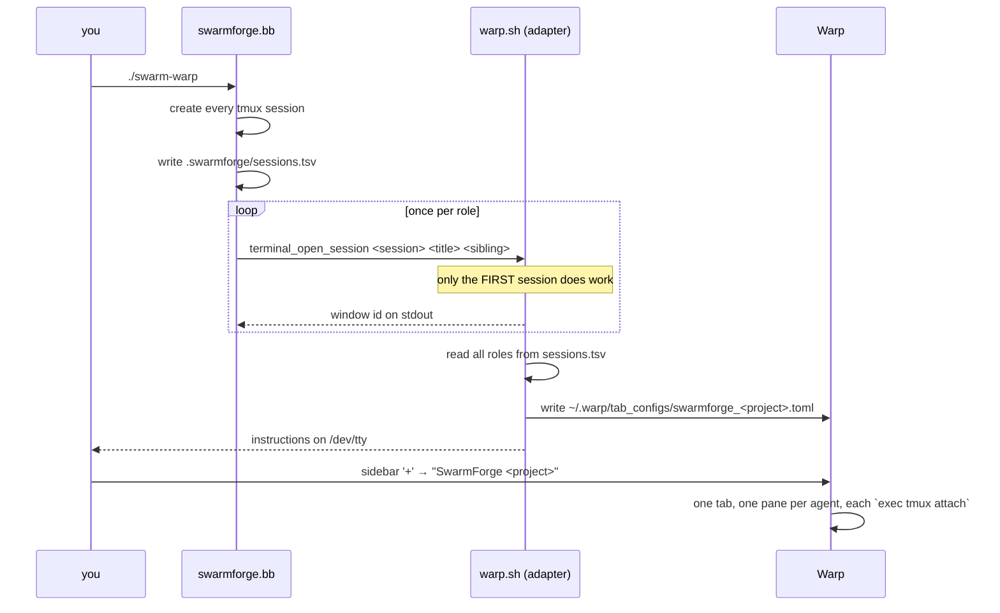

# swarmforge-warp

Run [SwarmForge](https://github.com/unclebob/swarm-forge) inside [Warp](https://www.warp.dev/) with every agent as a **pane in one tab** instead of one macOS Terminal window per agent.

SwarmForge orchestrates several coding agents, each in its own tmux session, and asks the terminal to open a surface per session. Warp is not one of the terminals it knows about, so its detection falls through to `osascript` and you get a scattering of Terminal.app windows. This repo adds a `warp` terminal adapter that generates a [Warp Tab Config](https://docs.warp.dev/terminal/windows/tab-configs) describing the whole swarm as a single tab.

```
┌──────────────────────── Warp: SwarmForge my-project ────────────────────────┐
│ specifier          │ cleaner            │ hardender                        │
│ (tmux attach)      │ (tmux attach)      │ (tmux attach)                    │
├────────────────────┼────────────────────┼──────────────────────────────────┤
│ coder              │ architect          │ QA                               │
│ (tmux attach)      │ (tmux attach)      │ (tmux attach)                    │
└─────────────────────────────────────────────────────────────────────────────┘
```

This is an **overlay repo**: it changes nothing upstream. SwarmForge is a pinned install-time dependency, and the adapter is a new file that upstream's loader picks up unmodified.

## Prerequisites

| Tool | Why | Install |
|---|---|---|
| [Warp](https://www.warp.dev/) | the terminal this targets (macOS) | <https://www.warp.dev/download> |
| zsh | SwarmForge's terminal adapters are zsh scripts | ships with macOS |
| git | SwarmForge gives each agent its own worktree | `brew install git` |
| tmux | every agent runs inside a tmux session | `brew install tmux` |
| babashka (`bb`) | SwarmForge itself is a babashka script | `brew install borkdude/brew/babashka` |
| an agent CLI | `claude`, `codex`, `copilot` or `grok` — SwarmForge validates this field against exactly that list | per vendor |

`python3` (3.11+) is needed only to run the test suite.

## Set up in any repository

Five steps, start to finish. **No clone of this repo is required** — the installer runs straight from GitHub and fetches what it needs, so this works the same on a machine you never want to check anything out on.

### 1. Install and configure, in one command

From inside the project you want the swarm to work on:

```sh
curl -fsSL https://raw.githubusercontent.com/Cpicon/swarmforge-warp/main/install.sh \
  | sh -s -- --branch six-pack --agent claudio --scaffold-project-prompt
```

```
Downloading SwarmForge six-pack ...
  installed ./swarm and swarmforge/ from six-pack
  merged the pack's ignore rules into your .gitignore
  configured swarmforge.conf for claude
  made 3 shared constitution article(s) reachable
  scaffolded swarmforge/constitution/articles/project.prompt (edit the TODOs)
```

Pick `--branch two-pack` (2 agents), `four-pack` (4) or `six-pack` (6). Pick `--agent` from `claude`, `codex`, `copilot`, `grok`, or `claudio` for claude with permission checks bypassed; omit it and the first one found on `PATH` is used. The installer is idempotent — re-run it to upgrade.

> Working from a clone instead? `cd /path/to/your/project && /path/to/swarmforge-warp/install.sh --branch six-pack --agent claudio --scaffold-project-prompt`. Identical result; the installer copies the two overlay files locally rather than fetching them.

### 2. Commit the config — the agents cannot see it otherwise

```sh
git checkout -b chore/swarmforge
git add -A && git commit -m "chore: install swarmforge-warp"
```

This is not housekeeping. Each role gets a git worktree created with `git worktree add … HEAD`, which checks out **committed files only**. SwarmForge syncs `swarmforge/scripts/` and `.swarmforge/` state into each worktree at launch, but *not* `swarmforge.conf`, `constitution.prompt`, `constitution/articles/` or `roles/`. Leave those uncommitted and every agent starts with no role and no constitution — and nothing reports an error, because the agent is handed a pointer to files that simply are not there.

`git diff .gitignore` should show your own entries intact with a `# SwarmForge` block appended.

#### Keeping it out of a shared repository

If this is a company repo you do not want to push swarm config to, **do not install into your working checkout**. Give the swarm its own clone; then committing affects nobody, and your real checkout is never touched at all:

```sh
git clone <repo-url> ~/swarms/my-project      # a clone that is yours alone
cd ~/swarms/my-project
git checkout -b swarm/base

curl -fsSL https://raw.githubusercontent.com/Cpicon/swarmforge-warp/main/install.sh \
  | sh -s -- --branch six-pack --agent claudio --scaffold-project-prompt
git add -A && git commit -m "swarm config (local only, never pushed)"

./swarm-warp
```

Harvest the work as a patch that excludes the swarm's own files, and apply it in your real checkout:

```sh
# in the swarm clone, once QA has closed the loop
git diff swarm/base..swarmforge-specifier -- . \
  ':(exclude)swarmforge' ':(exclude)swarm' ':(exclude)swarm-warp' > /tmp/feature.patch

cd ~/code/my-project && git checkout -b feat/TICKET-123 && git apply /tmp/feature.patch
```

The pathspec exclusions are what keep `swarmforge/`, `swarm` and `swarm-warp` from travelling with the work. Your shared repo sees an ordinary feature branch and never learns a swarm was involved.

This also sidesteps a subtler problem: the agents branch from `HEAD`, so anything you commit to make the swarm work becomes an ancestor of every `swarmforge-*` branch. Merging one of those back into a branch you intend to push would carry the swarm config with it.

> Installing into your working checkout and simply not committing does **not** work — see above. Nor does `.gitignore` or `.git/info/exclude`: ignoring a file does not put it in a worktree. The choice is a dedicated clone, or a local branch you are careful never to push.

### 3. Fill in `project.prompt` — the one step that is genuinely yours

`swarmforge/constitution/articles/project.prompt` tells **every** agent what your project is. `--scaffold-project-prompt` left it with detected languages filled in and the rest as `TODO`s. The fastest way to finish it is to hand the job to a plain Claude Code session in that repo:

> Read `swarmforge/constitution/articles/project.prompt`. It is a constitution that six autonomous coding agents will read as fact before working in this repository, and it currently contains TODOs.
>
> Investigate this repository and rewrite the file so every TODO is resolved. Determine and state:
>
> 1. **Languages and runtimes** actually used here, with versions where they are pinned. Delete any language the scaffold guessed that is incidental.
> 2. **The dependency and environment tooling** — how dependencies are installed and how a command is run inside the project environment. Give the literal commands.
> 3. **The test command and the lint/format command**, exactly as they must be typed, per package if the repo has more than one. State that a change is not done until both pass.
> 4. **Repository layout** — where source, tests, infrastructure and scripts live, and where new code of each kind belongs. Agents work in separate git worktrees and cannot ask each other, so be concrete.
> 5. **Guardrails** — anything an agent must never run. Include anything that mutates cloud infrastructure, costs money, touches production, deploys, publishes, or needs credentials the agents will not have. Also list anything that requires hardware they lack, such as a GPU. Say explicitly that if a task appears to require one of these, the agent must stop and ask.
> 6. **Conventions** worth stating — commit message format, branch naming, and any house rules a newcomer would get wrong.
>
> Base every statement on evidence in the repository: config files, CI workflows, existing tests, contributor docs. Do not guess. If you cannot determine something, leave a clearly marked TODO rather than inventing an answer — a confidently wrong constitution is worse than an obviously incomplete one. Keep the existing section headings, and keep the `## Local Configuration` and `## Ownership` sections unchanged.

Read the result before you launch. This file is the highest-leverage text in the whole setup: the packs ship one claiming the project language is Babashka, and every agent believes it.

### 4. Dry run

```sh
bb swarmforge/scripts/swarmforge.bb --test-parse "$(pwd)"
```

Prints one line per role. This writes `.swarmforge/` state but creates no worktrees, no branches, no tmux sessions and no agents — nothing is spent. If the conf is malformed or a role prompt is missing, it fails here instead of six panes in.

### 5. Launch

```sh
./swarm-warp
```

Then **sidebar `+` → "SwarmForge \<project\>"**. See [A worked example](#a-worked-example) for what to type once the panes are up.

### Options

| Option | Default | Meaning |
|---|---|---|
| `--branch <pack>` | `four-pack` | Which SwarmForge pack to install if the project has no `./swarm` yet: `two-pack` (2 agents), `four-pack` (4), `six-pack` (6) |
| `--upstream-ref <ref>` | `main` | Ref of `unclebob/swarm-forge` used for the archive that provides `swarmforge/scripts` |
| `--overlay-ref <ref>` | `main` | Ref of this repo to pull `adapter/warp.sh` and `bin/swarm-warp` from when the installer is piped rather than run from a clone. Also settable via `$SWARMFORGE_WARP_REF` |
| `--skip-fetch` | off | Download nothing from SwarmForge; only install the adapter and launcher into a project that already has them |
| `--configure` | off | Apply the post-install fixes every project needs — see below. Implied by `--agent`, `--agent-args` and `--scaffold-project-prompt` |
| `--agent <cli>` | detected | `claude`, `codex`, `copilot`, `grok`, or `claudio` as shorthand for claude with permission checks bypassed. Defaults to the first found on `PATH` |
| `--agent-args <args>` | — | Extra arguments appended to every role, e.g. `'--permission-mode plan'` |
| `--keep-first-role-in-root` | off | Leave the first role in your working checkout (not recommended — see below) |
| `--no-shared-articles` | off | Skip merging upstream's shared constitution articles |
| `--scaffold-project-prompt` | off | Replace the pack's `project.prompt` with one describing *this* repository |

### `--configure`: the fixes every project needs

The packs are configured for the repository they were authored in. Installed as-is they name an agent CLI you may not have, park the first role in your own working checkout, and leave upstream's shared constitution articles somewhere nothing reads. Those three fixes are identical in every project, so `--configure` does them:

```sh
cd /any/repo
/path/to/swarmforge-warp/install.sh --branch six-pack --agent claudio --scaffold-project-prompt
```

```
  configured swarmforge.conf for claude
  made 3 shared constitution article(s) reachable
  scaffolded swarmforge/constitution/articles/project.prompt (edit the TODOs)
```

- **Agent** — rewrites every role's agent column, preserving comments, receive modes and field order. `claudio` is not a SwarmForge agent (the parser validates that field against a fixed allowlist and rejects anything else), so the installer translates it to `claude --permission-mode bypassPermissions`, which is what the alias expands to.
- **First-role worktree** — the packs assign the first role the `master` worktree, one of two names SwarmForge maps to your main checkout rather than `.worktrees/`. That makes the swarm and you share one working tree: switching branches there removes that agent's constitution mid-run with no error, and you cannot work while the swarm works. `--configure` names the worktree after the role instead.
- **Shared articles** — `constitution.prompt` points agents at `swarmforge/constitution/articles/`, but a pack install leaves upstream's shared articles (the handoff protocol, the "stop and ask when blocked" rule, the commit byline) in `swarmforge/scripts/shared-articles/`, which nothing references. They are copied across; a pack-local article of the same name is never overwritten, since upstream treats those as deliberate overrides.

**One thing stays manual, and should.** `swarmforge/constitution/articles/project.prompt` tells every agent what your project *is* — language, layout, test command, and what they must never run. The packs ship one describing their own repository (it says the project language is Babashka), and agents read it as fact. `--scaffold-project-prompt` writes one from what it can detect and leaves the rest as explicit `TODO`s rather than guessing, because a confidently wrong constitution is worse than an obviously incomplete one.

### What it puts where

```
your-project/
├── swarm                                          # from the pack branch
├── swarm-warp                                     # ← this repo (launcher)
└── swarmforge/
    ├── swarmforge.conf                            # from the pack branch
    ├── roles/
    └── scripts/                                   # from swarm-forge <upstream-ref>
        └── terminal-adapters/
            └── warp.sh                            # ← this repo (the adapter)
```

> **Why the installer downloads `swarmforge/scripts` itself.** The pack branches ship without that directory; `./swarm` bootstraps it from the `main` archive on first run — but only when the directory is *absent*. Since installing the adapter creates `swarmforge/scripts/terminal-adapters/`, that check would never fire again and `./swarm` would fail to find `swarmforge.sh`. The installer therefore performs the same bootstrap first. Using `--skip-fetch` on a project that has never run `./swarm` trips this; the installer warns when it detects that.

> **Your `.gitignore` is preserved.** The pack branches ship a `.gitignore` of their own, and the pack is installed with `cp -R`, which would replace an existing one wholesale — silently un-ignoring whatever it covered. The installer takes the pack's copy out of the unpacked tree *before* the copy runs, so your file is never a candidate for being overwritten, then appends only the entries it does not already contain under a `# SwarmForge (added by swarmforge-warp)` header. If the copy fails partway, your `.gitignore` is untouched and the installer says so.

## Usage

```sh
./swarm-warp
```

That is just `SWARMFORGE_TERMINAL=warp ./swarm "$@"` — all arguments are passed straight through. You can also set the variable yourself:

```sh
SWARMFORGE_TERMINAL=warp ./swarm
```

SwarmForge prints one yellow notice at startup:

```
Warp surfaces are not trackable; window watchdog is disabled for this backend.
```

That is expected, and it is SwarmForge's own message rather than the adapter's. It is acknowledging `terminal_backend_tracks_windows` = false — see [Limitations](#limitations). Nothing is wrong.

It then starts the tmux sessions as usual, and the adapter prints something like:

```
  SwarmForge → Warp
  Wrote tab config: /Users/you/.warp/tab_configs/swarmforge_my_project.toml
  Open it with:     Warp sidebar '+' menu → "SwarmForge my-project"
  All 6 agents appear as panes in that one tab.
  The panes close themselves when the swarm stops.
```

**Click the sidebar `+` and pick the config.** It opens in the current window. Each pane attaches to one agent's tmux session.

Once it is running, you drive the swarm from the **first** pane — see [A worked example](#a-worked-example) for what to type and what the other panes do.

To stop it, kill the sessions and the handoff daemon:

```sh
SWARMFORGE_TERMINAL_BACKEND=warp swarmforge/scripts/swarm-cleanup.sh \
  "$(cat .swarmforge/tmux-socket)" .swarmforge/window-ids \
  $(cut -f3 .swarmforge/sessions.tsv)
```

Closing the panes does **not** stop the agents; they run `exec tmux attach-session`, so closing a pane only detaches it.

## A worked example

Putting a six-agent swarm on an existing repo — `~/code/ml-platform`, a real project with its own history, CI and `.gitignore` — using `claude` as the agent CLI.

### 1. Set up

Follow [Set up in any repository](#set-up-in-any-repository) — install and configure, commit, fill in `project.prompt`. For this example:

```sh
cd ~/code/ml-platform && git checkout -b chore/swarmforge-warp
curl -fsSL https://raw.githubusercontent.com/Cpicon/swarmforge-warp/main/install.sh \
  | sh -s -- --branch six-pack --agent claudio --scaffold-project-prompt
```

The resulting `swarmforge/swarmforge.conf`:

```
# Format: window <role> <agent> <worktree> [task|batch] [extra-cli-args...]
window specifier claude specifier --permission-mode bypassPermissions
window coder     claude coder     --permission-mode bypassPermissions
window cleaner   claude cleaner   batch --permission-mode bypassPermissions
window architect claude architect batch --permission-mode bypassPermissions
window hardender claude hardender batch --permission-mode bypassPermissions
window QA        claude QA        batch --permission-mode bypassPermissions
```

Two things worth understanding about that file, because they explain why `--configure` exists:

- **The agent field is an allowlist, not a command.** `swarmforge.bb` accepts only `claude`, `codex`, `copilot` or `grok`, and builds a fixed command template per name. A shell alias — `claudio`, say — is rejected at config-parse time with `Unsupported agent`, even though the command is ultimately delivered by tmux `send-keys` into an interactive shell where the alias *would* have expanded. `--agent claudio` translates it for you.
- **Everything after the receive mode is passed through to the CLI.** That is the supported way to get alias-like behaviour. SwarmForge already launches Claude with `--permission-mode acceptEdits`; a trailing `--permission-mode bypassPermissions` is appended after it and wins, which is the same unattended posture as `claude --dangerously-skip-permissions`. Use `--agent claude` instead of `claudio` to keep `acceptEdits`, which still lets agents edit files but prompts for other tools.

### 2. Dry-run before spending anything

`swarmforge.bb` has test hooks that stop short of starting agents. They create `.swarmforge/` state files, an empty `.worktrees/`, and the tab config — but no git worktrees, no branches, no tmux sessions and no agent processes, so this is a genuine dry run:

```sh
bb swarmforge/scripts/swarmforge.bb --test-parse "$(pwd)"
```

Confirms the conf parses and shows each role's worktree, receive mode and extra args. Then check the exact command an agent will run — this hook always renders the `coder` role, and it shows a *non-first* role's command; the first role in the conf additionally gets a `swarm-cleanup.sh` trailer that fires when its agent exits:

```sh
bb swarmforge/scripts/swarmforge.bb --test-launch-command "$(pwd)" claude "--permission-mode bypassPermissions"
```

```
… claude --append-system-prompt-file '.../coder.md' --permission-mode acceptEdits \
  -n 'SwarmForge Coder' --permission-mode bypassPermissions "$(cat '.../coder.md')"
```

Then drive this adapter through SwarmForge's own bridge:

```sh
bb swarmforge/scripts/swarmforge.bb --test-terminal-bridge "$(pwd)" warp
```

`warp-tab-config` on stdout means the adapter ran and wrote `~/.warp/tab_configs/swarmforge_ml_platform.toml`. Open it from Warp's sidebar now if you want to see the layout before any agent starts — the panes will just fail to attach, since the tmux sessions do not exist yet.

### 3. Run it

```sh
./swarm-warp
```

Then **sidebar `+` → "SwarmForge ml-platform"**. Six panes in one tab, in `sessions.tsv` order:

```
┌──────────────────────── Warp: SwarmForge ml-platform ───────────────────────┐
│ specifier          │ cleaner            │ hardender                        │
│ coder              │ architect          │ QA                               │
└─────────────────────────────────────────────────────────────────────────────┘
```

Each pane is one agent, attached to its own tmux session, working in its own git worktree under `.worktrees/<role>` on a branch called `swarmforge-<role>`.

> **Give the first role a worktree too** — do this before you launch. The packs ship `window specifier claude master`, and `master` is one of the two names (`none` is the other) that SwarmForge maps to **your main checkout** instead of to `.worktrees/`. That means the swarm and you share one working tree, which has bitten us twice:
>
> - **Switching branches in the project root silently lobotomises that agent.** Its system prompt is only a pointer — *"read `swarmforge/constitution.prompt`, then every file it refers to"* — so a checkout that removes those tracked files leaves it with no role, no constitution and no handoff protocol, and **nothing reports an error**. The other five, being in real worktrees, are unaffected.
> - **You cannot work while the swarm works**, which defeats the point of running one.
>
> Any worktree name other than `none` or `master` gets a real worktree, so the fix is one word in `swarmforge/swarmforge.conf`:
>
> ```diff
> -window specifier claude master
> +window specifier claude specifier
> ```
>
> Completed work then arrives as a `swarmforge-specifier` branch you merge when convenient, rather than as commits appearing under whatever you happen to have checked out.
>
> Keep the swarm's `swarmforge/` config on the branch you launch from — after launch each agent reads its own worktree's copy, so you are free to switch branches in the root while it runs.

### 4. Give the swarm its first feature

**You talk to `specifier`. That is the whole interface.** Click that pane and type what you want, exactly as you would prompt a single agent:

```
Add a /healthz endpoint that returns 200 with {"status":"ok"} and the current
git SHA, and 503 if the database ping fails.
```

What happens next, in order:

1. **`specifier` asks you questions.** Its prompt tells it to "ask questions to settle ambiguity" — expect to be asked what counts as a database ping, what the timeout is, and so on. Answer in that pane.
2. **It writes the specification** — Gherkin feature files plus an end-to-end QA procedure — then **stops and waits for you**. This gate is explicit in its prompt: *"Do not commit or notify coder until the user explicitly approves the handoff."* Nothing reaches the other five agents until you clear it.
3. **You approve.** It commits the spec, invents a short task name, and sends a `git_handoff` to `coder`.
4. **The other five panes start moving on their own.** You do not drive this part.
5. **`QA` finishes and notifies `specifier`**, which merges the work and asks you what feature you want next.

So one full cycle is: *prompt the specifier → answer its questions → approve once → watch → answer "what next?"*.

### 5. What the other five panes are doing

Work moves down a fixed pipeline, each agent handing the next one a **commit**, not a diff or a chat message:

```
specifier ─▶ coder ─▶ cleaner ─▶ architect ─▶ hardender ─▶ QA ─┐
    ▲                                                          │
    └──────────────── merge, then "what next?" ────────────────┘
```

| Pane | Owns | Hands to |
|---|---|---|
| `specifier` | Gherkin specs and end-to-end QA procedures. **Your entry point.** | `coder`, after your approval |
| `coder` | TDD implementation of the approved slice: failing unit test first, then code | `cleaner` |
| `cleaner` | Behaviour-preserving cleanup — names, duplication, local coupling, coverage | `architect` |
| `architect` | Module boundaries, dependency direction, property-test coverage; no behaviour change | `hardender` |
| `hardender` | Mutation testing — finds surviving mutants and kills them | `QA` |
| `QA` | Turns the specifier's QA procedures into executable scripts; runs the end-to-end suite through the UI only, plus unit, property and acceptance tests | all five roles |

`QA` is the exception to the single-arrow diagram: it broadcasts completion to all five other roles, which merge the result without forwarding it further. Only that terminal broadcast is merge-only.

**You do not normally type into panes 2–6.** They coordinate through handoff files, not through you: an agent commits, writes a small draft, and runs `swarm_handoff.sh`, which queues it; a daemon copies it to the recipient's inbox and sends a wake-up; the recipient runs `ready_for_next.sh`, merges the named commit, does its job, and runs `done_with_current.sh`.

Read those panes anyway, because **an agent that gets stuck stops and asks** and will sit there until you answer *in that pane*. If the pipeline goes quiet, that is the first thing to check.

> **A packaging gap worth knowing about.** Upstream ships shared constitution articles — the handoff rules, the "stop and ask when blocked" rule that applies to *every* role, and a `By <role>.` commit byline convention. In a pack install those land in `swarmforge/scripts/shared-articles/`, and **nothing references that path**: `constitution.prompt` points agents only at `swarmforge/constitution/articles/`, which holds just the three pack-local files. So by default only `QA` is explicitly told to stop and ask (and only about Gherkin conflicts), and no role is told to add the byline. To opt in:
>
> ```sh
> cp -n swarmforge/scripts/shared-articles/*.prompt swarmforge/constitution/articles/
> ```
>
> This is upstream's packaging, not something this overlay changes. Verified against swarm-forge `main` and `six-pack`; if upstream fixes it, the copy becomes a no-op.

If you are coming from single-agent Claude Code, the differences that matter:

| Single-agent Claude Code | This swarm |
|---|---|
| You prompt the agent that does the work | You prompt `specifier`; five others pick up behind it |
| One working tree | Six worktrees, one branch per role |
| You review at the end | Each stage reviews the previous stage's commit |
| You approve tool calls as they come | One human gate: spec → coder. After that it runs unattended |
| `Ctrl-C` stops it | See below — closing panes does not stop anything |

### 6. Stopping it, and recovering a closed pane

**Closing a Warp pane does not stop that agent.** The pane runs `exec tmux attach-session`, so closing it only detaches; the tmux session and the agent keep running. Upstream's docs say closing the first window shuts the swarm down and that a watchdog reopens the others — neither applies here, because this adapter reports `terminal_backend_tracks_windows` = false and SwarmForge therefore skips the watchdog, which is what implements both behaviours.

**To stop the swarm, quit the agent in the first pane** — `/exit` in the `specifier`'s Claude session, or whatever your agent CLI uses. SwarmForge appends a cleanup trailer to the *first* role's launch command, so when that agent exits it runs `swarm-cleanup.sh` and tears down every session and the handoff daemon. That is command-driven rather than window-driven, so it works normally under Warp.

If that pane is already gone, run the cleanup yourself from the project root:

```sh
SWARMFORGE_TERMINAL_BACKEND=warp swarmforge/scripts/swarm-cleanup.sh \
  "$(cat .swarmforge/tmux-socket)" .swarmforge/window-ids \
  $(cut -f3 .swarmforge/sessions.tsv)
```

> Upstream documents a `./close-swarm` wrapper for this, but it lives on swarm-forge's `main` branch and is **not** part of a pack, so a project installed this way does not have one. The command above is what `close-swarm` ends up calling.

To re-attach one pane you closed, open a Warp pane, `cd` to the project root and run:

```sh
exec tmux -S "$(cat .swarmforge/tmux-socket)" attach-session -t swarmforge-coder
```

Re-opening the whole tab from the sidebar `+` works too, but only do that if you closed the *whole* tab: it spawns all six panes, and any session still attached elsewhere gains a second client, after which tmux sizes the window to the smallest attached client.

### Backing it out

The install is confined to the branch plus one file outside the repo:

```sh
git checkout main && git branch -D chore/swarmforge-warp
git clean -fd swarm swarm-warp swarmforge
rm -rf .swarmforge .worktrees
rm -f ~/.warp/tab_configs/swarmforge_ml_platform.toml
```

## How it works



Three details make this work:

1. **SwarmForge writes `sessions.tsv` for every role before the first `terminal_open_session` call.** So the adapter can generate one complete tab config on that first call and no-op for the rest (each later call just echoes `warp-noop-<session>`).
2. **Pane commands use `exec tmux … attach-session`.** The `exec` matters: when the swarm shuts down, the pane's shell *is* the tmux client, so the pane closes cleanly. Without it you get red `[server exited]` blocks and a warning badge on the tab.
3. **The adapter reports `terminal_backend_tracks_windows` = false.** Warp exposes no API to enumerate or close panes, so window ids cannot be tracked. SwarmForge treats this as a supported degraded mode and skips its window watchdog.

### Pane layout

Panes appear in `sessions.tsv` order, filling columns top-to-bottom then left-to-right. Warp sizes all children of a split equally.

| Agents | Layout |
|---|---|
| 1 | a single pane |
| 2–3 | one row |
| 4 | 2 × 2 |
| 5 | 3 columns (2, 2, 1) |
| 6 | 3 × 2 |
| >6 | `ceil(sqrt(n))` columns, remainder front-loaded |

The first agent's pane gets `is_focused = true`.

### The generated config

```toml
name = "SwarmForge my-project"
color = "cyan"

[[panes]]
id = "root"
split = "horizontal"
children = ["col_1", "col_2"]

[[panes]]
id = "col_1"
split = "vertical"
children = ["specifier", "coder"]

[[panes]]
id = "specifier"
type = "terminal"
directory = "/Users/you/code/my-project"
commands = ["exec tmux -S /tmp/swarmforge-501/1234.sock attach-session -t swarmforge-specifier"]
is_focused = true
# … one [[panes]] entry per agent …
```

It is regenerated on every swarm start, but only rewritten when the content actually changes, so repeated runs leave the file's mtime alone.

Set `SWARMFORGE_WARP_TAB_CONFIG_DIR` to write somewhere other than `~/.warp/tab_configs`.

## Limitations

- **Opening the tab takes one click.** There is no supported way to make Warp open a tab config from a script; the sidebar `+` menu is the entry point. (Warp documents a `warp://tab_config/<name>` URI, but URI-scheme automation was found not to work in current Warp Stable during this integration's testing, so nothing here depends on it.)
- **No window watchdog.** SwarmForge normally polls whether an agent's window was closed and reopens it. Warp has no pane query API, so that feature is off. Closing a pane tells SwarmForge nothing, nothing reopens it, and the agent keeps running detached — re-attach from the project root with `exec tmux -S "$(cat .swarmforge/tmux-socket)" attach-session -t swarmforge-<role>`. Shutdown is unaffected: it hangs off the first role's launch command, not off any window. See [Stopping it](#6-stopping-it-and-recovering-a-closed-pane).
- **No AppleScript.** Warp ships no AppleScript dictionary, so the `osascript` tricks the iTerm2/Ghostty/Terminal.app adapters use are unavailable.
- **macOS only**, and only tested against Warp Stable.
- **A tab config per project directory.** The filename is derived from the project's basename (lowercased, non-alphanumerics → `_`), so two projects whose basenames slugify identically share one config.

## Uninstall

```sh
cd /path/to/your/project
rm -f swarm-warp swarmforge/scripts/terminal-adapters/warp.sh
rm -f ~/.warp/tab_configs/swarmforge_*.toml
```

SwarmForge itself is untouched — it goes back to its own terminal detection.

## Development

```sh
./test/smoke.sh
```

The suite needs no Warp UI, no tmux server and no network. It runs the adapter the way SwarmForge does — a fresh `zsh -c` with `SCRIPT_DIR`/`WORKING_DIR`/`TMUX_SOCKET` set and stdout captured as the window id — against a throwaway `$HOME`, so your real `~/.warp/` is never written to. It covers layouts for 1–6 agents, TOML validity and pane-tree soundness, the no-op paths, escaping of paths containing spaces and quotes, and both installer paths.

The fetching path is covered without touching the network by putting a stub `curl` at the front of `PATH`. `install.sh` only ever calls `curl -fsSL <url> -o <dest>`, so serving two locally built archives exercises the real `fetch_pack` and `bootstrap_scripts` — the `cp -R` included, which is what the `.gitignore` preservation tests pin. That keeps the test hooks in the test suite rather than adding injection points to `install.sh`.

Two things worth knowing before editing `adapter/warp.sh`:

- **No `set -e`.** The file is sourced into a live shell by `swarm-terminal-adapter.sh`; errexit there would kill the caller.
- **No top-level variables.** Upstream's `load_terminal_backend` sources the adapter *from inside a function*, and zsh scopes `typeset`/`readonly`/`local` to that function — such a variable is gone before `terminal_open_session` ever runs. Only function definitions survive. The suite enforces both rules.

## Layout

| Path | What |
|---|---|
| `adapter/warp.sh` | the terminal adapter (the core artifact) |
| `bin/swarm-warp` | launcher: `SWARMFORGE_TERMINAL=warp exec ./swarm "$@"` |
| `install.sh` | installer, works from a clone or piped from `curl` |
| `test/smoke.sh` | UI-free test suite |
