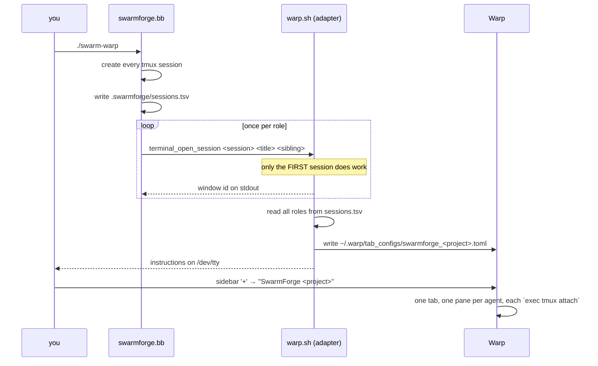

# swarmforge-warp

Run [SwarmForge](https://github.com/unclebob/swarm-forge) inside [Warp](https://www.warp.dev/) with every agent as a **pane in one tab** instead of one macOS Terminal window per agent.

SwarmForge orchestrates several coding agents, each in its own tmux session, and asks the terminal to open a surface per session. Warp is not one of the terminals it knows about, so its detection falls through to `osascript` and you get a scattering of Terminal.app windows. This repo adds a `warp` terminal adapter that generates a [Warp Tab Config](https://docs.warp.dev/terminal/windows/tab-configs) describing the whole swarm as a single tab.

```
┌──────────────────────── Warp: SwarmForge my-project ────────────────────────┐
│ specifier          │ cleaner            │ hardender                        │
│ (tmux attach)      │ (tmux attach)      │ (tmux attach)                    │
├────────────────────┼────────────────────┼──────────────────────────────────┤
│ coder              │ architect          │ QA                               │
│ (tmux attach)      │ (tmux attach)      │ (tmux attach)                    │
└─────────────────────────────────────────────────────────────────────────────┘
```

This is an **overlay repo**: it changes nothing upstream. SwarmForge is a pinned install-time dependency, and the adapter is a new file that upstream's loader picks up unmodified.

## Prerequisites

| Tool | Why | Install |
|---|---|---|
| [Warp](https://www.warp.dev/) | the terminal this targets (macOS) | <https://www.warp.dev/download> |
| zsh | SwarmForge's terminal adapters are zsh scripts | ships with macOS |
| git | SwarmForge gives each agent its own worktree | `brew install git` |
| tmux | every agent runs inside a tmux session | `brew install tmux` |
| babashka (`bb`) | SwarmForge itself is a babashka script | `brew install borkdude/brew/babashka` |
| an agent CLI | `codex`, `claude` or `gemini` — whichever `swarmforge/swarmforge.conf` names | per vendor |

`python3` (3.11+) is needed only to run the test suite.

## Install

From inside the project directory you want the swarm to work on:

```sh
curl -fsSL https://raw.githubusercontent.com/Cpicon/swarmforge-warp/main/install.sh | sh -s -- --branch four-pack
```

Or from a clone of this repo:

```sh
cd /path/to/your/project
/path/to/swarmforge-warp/install.sh --branch four-pack
```

The installer is idempotent — re-run it to upgrade.

### Options

| Option | Default | Meaning |
|---|---|---|
| `--branch <pack>` | `four-pack` | Which SwarmForge pack to install if the project has no `./swarm` yet: `two-pack` (2 agents), `four-pack` (4), `six-pack` (6) |
| `--upstream-ref <ref>` | `main` | Ref of `unclebob/swarm-forge` used for the archive that provides `swarmforge/scripts` |
| `--overlay-ref <ref>` | `main` | Ref of this repo to pull `adapter/warp.sh` and `bin/swarm-warp` from when the installer is piped rather than run from a clone. Also settable via `$SWARMFORGE_WARP_REF` |
| `--skip-fetch` | off | Download nothing from SwarmForge; only install the adapter and launcher into a project that already has them |

### What it puts where

```
your-project/
├── swarm                                          # from the pack branch
├── swarm-warp                                     # ← this repo (launcher)
└── swarmforge/
    ├── swarmforge.conf                            # from the pack branch
    ├── roles/
    └── scripts/                                   # from swarm-forge <upstream-ref>
        └── terminal-adapters/
            └── warp.sh                            # ← this repo (the adapter)
```

> **Why the installer downloads `swarmforge/scripts` itself.** The pack branches ship without that directory; `./swarm` bootstraps it from the `main` archive on first run — but only when the directory is *absent*. Since installing the adapter creates `swarmforge/scripts/terminal-adapters/`, that check would never fire again and `./swarm` would fail to find `swarmforge.sh`. The installer therefore performs the same bootstrap first. Using `--skip-fetch` on a project that has never run `./swarm` trips this; the installer warns when it detects that.

## Usage

```sh
./swarm-warp
```

That is just `SWARMFORGE_TERMINAL=warp ./swarm "$@"` — all arguments are passed straight through. You can also set the variable yourself:

```sh
SWARMFORGE_TERMINAL=warp ./swarm
```

SwarmForge starts the tmux sessions as usual, then the adapter prints something like:

```
  SwarmForge → Warp
  Wrote tab config: /Users/you/.warp/tab_configs/swarmforge_my_project.toml
  Open it with:     Warp sidebar '+' menu → "SwarmForge my-project"
  All 6 agents appear as panes in that one tab.
  The panes close themselves when the swarm stops.
```

**Click the sidebar `+` and pick the config.** It opens in the current window. Each pane attaches to one agent's tmux session.

To stop, use SwarmForge's own `./close-swarm` (or kill the tmux sessions). The panes close themselves.

## How it works



Three details make this work:

1. **SwarmForge writes `sessions.tsv` for every role before the first `terminal_open_session` call.** So the adapter can generate one complete tab config on that first call and no-op for the rest (each later call just echoes `warp-noop-<session>`).
2. **Pane commands use `exec tmux … attach-session`.** The `exec` matters: when the swarm shuts down, the pane's shell *is* the tmux client, so the pane closes cleanly. Without it you get red `[server exited]` blocks and a warning badge on the tab.
3. **The adapter reports `terminal_backend_tracks_windows` = false.** Warp exposes no API to enumerate or close panes, so window ids cannot be tracked. SwarmForge treats this as a supported degraded mode and skips its window watchdog.

### Pane layout

Panes appear in `sessions.tsv` order, filling columns top-to-bottom then left-to-right. Warp sizes all children of a split equally.

| Agents | Layout |
|---|---|
| 1 | a single pane |
| 2–3 | one row |
| 4 | 2 × 2 |
| 5 | 3 columns (2, 2, 1) |
| 6 | 3 × 2 |
| >6 | `ceil(sqrt(n))` columns, remainder front-loaded |

The first agent's pane gets `is_focused = true`.

### The generated config

```toml
name = "SwarmForge my-project"
color = "cyan"

[[panes]]
id = "root"
split = "horizontal"
children = ["col_1", "col_2"]

[[panes]]
id = "col_1"
split = "vertical"
children = ["specifier", "coder"]

[[panes]]
id = "specifier"
type = "terminal"
directory = "/Users/you/code/my-project"
commands = ["exec tmux -S /tmp/swarmforge-501/1234.sock attach-session -t swarmforge-specifier"]
is_focused = true
# … one [[panes]] entry per agent …
```

It is regenerated on every swarm start, but only rewritten when the content actually changes, so repeated runs leave the file's mtime alone.

Set `SWARMFORGE_WARP_TAB_CONFIG_DIR` to write somewhere other than `~/.warp/tab_configs`.

## Limitations

- **Opening the tab takes one click.** There is no supported way to make Warp open a tab config from a script; the sidebar `+` menu is the entry point. (Warp documents a `warp://tab_config/<name>` URI, but URI-scheme automation was found not to work in current Warp Stable during this integration's testing, so nothing here depends on it.)
- **No window watchdog.** SwarmForge normally polls whether an agent's window was closed and reacts. Warp has no pane query API, so that feature is off. Closing a pane by hand will not tell SwarmForge anything; use `./close-swarm` to shut the swarm down.
- **No AppleScript.** Warp ships no AppleScript dictionary, so the `osascript` tricks the iTerm2/Ghostty/Terminal.app adapters use are unavailable.
- **macOS only**, and only tested against Warp Stable.
- **A tab config per project directory.** The filename is derived from the project's basename (lowercased, non-alphanumerics → `_`), so two projects whose basenames slugify identically share one config.

## Uninstall

```sh
cd /path/to/your/project
rm -f swarm-warp swarmforge/scripts/terminal-adapters/warp.sh
rm -f ~/.warp/tab_configs/swarmforge_*.toml
```

SwarmForge itself is untouched — it goes back to its own terminal detection.

## Development

```sh
./test/smoke.sh
```

The suite needs no Warp UI, no tmux server and no network. It runs the adapter the way SwarmForge does — a fresh `zsh -c` with `SCRIPT_DIR`/`WORKING_DIR`/`TMUX_SOCKET` set and stdout captured as the window id — against a throwaway `$HOME`, so your real `~/.warp/` is never written to. It covers layouts for 1–6 agents, TOML validity and pane-tree soundness, the no-op paths, escaping of paths containing spaces and quotes, and `install.sh --skip-fetch`.

Two things worth knowing before editing `adapter/warp.sh`:

- **No `set -e`.** The file is sourced into a live shell by `swarm-terminal-adapter.sh`; errexit there would kill the caller.
- **No top-level variables.** Upstream's `load_terminal_backend` sources the adapter *from inside a function*, and zsh scopes `typeset`/`readonly`/`local` to that function — such a variable is gone before `terminal_open_session` ever runs. Only function definitions survive. The suite enforces both rules.

## Layout

| Path | What |
|---|---|
| `adapter/warp.sh` | the terminal adapter (the core artifact) |
| `bin/swarm-warp` | launcher: `SWARMFORGE_TERMINAL=warp exec ./swarm "$@"` |
| `install.sh` | installer, works from a clone or piped from `curl` |
| `test/smoke.sh` | UI-free test suite |
