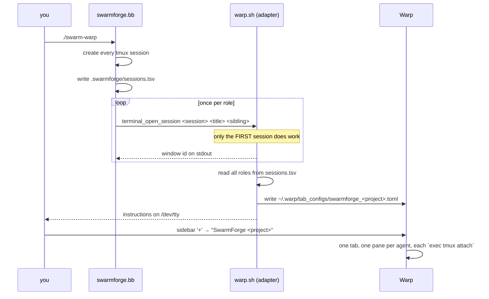

# swarmforge-warp

Run [SwarmForge](https://github.com/unclebob/swarm-forge) inside [Warp](https://www.warp.dev/) with every agent as a **pane in one tab** instead of one macOS Terminal window per agent.

SwarmForge orchestrates several coding agents, each in its own tmux session, and asks the terminal to open a surface per session. Warp is not one of the terminals it knows about, so its detection falls through to `osascript` and you get a scattering of Terminal.app windows. This repo adds a `warp` terminal adapter that generates a [Warp Tab Config](https://docs.warp.dev/terminal/windows/tab-configs) describing the whole swarm as a single tab.

```
┌──────────────────────── Warp: SwarmForge my-project ────────────────────────┐
│ specifier          │ cleaner            │ hardender                        │
│ (tmux attach)      │ (tmux attach)      │ (tmux attach)                    │
├────────────────────┼────────────────────┼──────────────────────────────────┤
│ coder              │ architect          │ QA                               │
│ (tmux attach)      │ (tmux attach)      │ (tmux attach)                    │
└─────────────────────────────────────────────────────────────────────────────┘
```

This is an **overlay repo**: it changes nothing upstream. SwarmForge is a pinned install-time dependency, and the adapter is a new file that upstream's loader picks up unmodified.

## Prerequisites

| Tool | Why | Install |
|---|---|---|
| [Warp](https://www.warp.dev/) | the terminal this targets (macOS) | <https://www.warp.dev/download> |
| zsh | SwarmForge's terminal adapters are zsh scripts | ships with macOS |
| git | SwarmForge gives each agent its own worktree | `brew install git` |
| tmux | every agent runs inside a tmux session | `brew install tmux` |
| babashka (`bb`) | SwarmForge itself is a babashka script | `brew install borkdude/brew/babashka` |
| an agent CLI | `codex`, `claude` or `gemini` — whichever `swarmforge/swarmforge.conf` names | per vendor |

`python3` (3.11+) is needed only to run the test suite.

## Install

From inside the project directory you want the swarm to work on:

```sh
curl -fsSL https://raw.githubusercontent.com/Cpicon/swarmforge-warp/main/install.sh | sh -s -- --branch four-pack
```

Or from a clone of this repo:

```sh
cd /path/to/your/project
/path/to/swarmforge-warp/install.sh --branch four-pack
```

The installer is idempotent — re-run it to upgrade.

### Options

| Option | Default | Meaning |
|---|---|---|
| `--branch <pack>` | `four-pack` | Which SwarmForge pack to install if the project has no `./swarm` yet: `two-pack` (2 agents), `four-pack` (4), `six-pack` (6) |
| `--upstream-ref <ref>` | `main` | Ref of `unclebob/swarm-forge` used for the archive that provides `swarmforge/scripts` |
| `--overlay-ref <ref>` | `main` | Ref of this repo to pull `adapter/warp.sh` and `bin/swarm-warp` from when the installer is piped rather than run from a clone. Also settable via `$SWARMFORGE_WARP_REF` |
| `--skip-fetch` | off | Download nothing from SwarmForge; only install the adapter and launcher into a project that already has them |

### What it puts where

```
your-project/
├── swarm                                          # from the pack branch
├── swarm-warp                                     # ← this repo (launcher)
└── swarmforge/
    ├── swarmforge.conf                            # from the pack branch
    ├── roles/
    └── scripts/                                   # from swarm-forge <upstream-ref>
        └── terminal-adapters/
            └── warp.sh                            # ← this repo (the adapter)
```

> **Why the installer downloads `swarmforge/scripts` itself.** The pack branches ship without that directory; `./swarm` bootstraps it from the `main` archive on first run — but only when the directory is *absent*. Since installing the adapter creates `swarmforge/scripts/terminal-adapters/`, that check would never fire again and `./swarm` would fail to find `swarmforge.sh`. The installer therefore performs the same bootstrap first. Using `--skip-fetch` on a project that has never run `./swarm` trips this; the installer warns when it detects that.

> **Your `.gitignore` is preserved.** The pack branches ship a `.gitignore` of their own, and the pack is installed with `cp -R`, which would replace an existing one wholesale — silently un-ignoring whatever it covered. The installer takes the pack's copy out of the unpacked tree *before* the copy runs, so your file is never a candidate for being overwritten, then appends only the entries it does not already contain under a `# SwarmForge (added by swarmforge-warp)` header. If the copy fails partway, your `.gitignore` is untouched and the installer says so.

## Usage

```sh
./swarm-warp
```

That is just `SWARMFORGE_TERMINAL=warp ./swarm "$@"` — all arguments are passed straight through. You can also set the variable yourself:

```sh
SWARMFORGE_TERMINAL=warp ./swarm
```

SwarmForge starts the tmux sessions as usual, then the adapter prints something like:

```
  SwarmForge → Warp
  Wrote tab config: /Users/you/.warp/tab_configs/swarmforge_my_project.toml
  Open it with:     Warp sidebar '+' menu → "SwarmForge my-project"
  All 6 agents appear as panes in that one tab.
  The panes close themselves when the swarm stops.
```

**Click the sidebar `+` and pick the config.** It opens in the current window. Each pane attaches to one agent's tmux session.

Once it is running, you drive the swarm from the **first** pane — see [A worked example](#a-worked-example) for what to type and what the other panes do.

To stop it, kill the sessions and the handoff daemon:

```sh
SWARMFORGE_TERMINAL_BACKEND=warp swarmforge/scripts/swarm-cleanup.sh \
  "$(cat .swarmforge/tmux-socket)" .swarmforge/window-ids \
  $(cut -f3 .swarmforge/sessions.tsv)
```

Closing the panes does **not** stop the agents; they run `exec tmux attach-session`, so closing a pane only detaches it.

## A worked example

Putting a six-agent swarm on an existing repo — `~/code/ml-platform`, a real project with its own history, CI and `.gitignore` — using `claude` as the agent CLI.

### 1. Install

Always from inside the target project, on a branch, since the installer adds tracked files to the repo root:

```sh
cd ~/code/ml-platform
git checkout -b chore/swarmforge-warp
~/code/swarmforge-warp/install.sh --branch six-pack
```

```
Downloading SwarmForge six-pack ...
  installed ./swarm and swarmforge/ from six-pack
  merged the pack's ignore rules into your .gitignore
Downloading SwarmForge scripts (main) ...
  installed swarmforge/scripts

swarmforge-warp installed in /Users/you/code/ml-platform
```

The packs ship their own `.gitignore`. On a project that already has one, the installer keeps yours and appends only the entries it lacks, under a `# SwarmForge (added by swarmforge-warp)` header. `git diff .gitignore` should show your own entries untouched and the new block appended at the end.

> If your `.gitignore` did not end in a newline, git also reports one deletion — the old last line, re-added with a newline. That is expected and harmless; look for `\ No newline at end of file` in the diff.

### 2. Point the roles at your agent CLI

The packs ship configured for `codex`. If you use something else, edit `swarmforge/swarmforge.conf`:

```
# Format: window <role> <agent> <worktree> [task|batch] [extra-cli-args...]
window specifier claude master   --permission-mode bypassPermissions
window coder     claude coder    --permission-mode bypassPermissions
window cleaner   claude cleaner  batch --permission-mode bypassPermissions
window architect claude architect batch --permission-mode bypassPermissions
window hardender claude hardender batch --permission-mode bypassPermissions
window QA        claude QA       batch --permission-mode bypassPermissions
```

Two things that are easy to get wrong here:

- **The agent field is an allowlist, not a command.** `swarmforge.bb` accepts only `claude`, `codex`, `copilot` or `grok`, and builds a fixed command template per name. A shell alias — `claudio`, say — is rejected at config-parse time with `Unsupported agent`, even though the command is ultimately delivered by tmux `send-keys` into an interactive shell where the alias *would* have expanded.
- **Everything after the receive mode is passed through to the CLI.** That is the supported way to get alias-like behaviour. SwarmForge already launches Claude with `--permission-mode acceptEdits`; a trailing `--permission-mode bypassPermissions` is appended after it and wins, which is the same unattended posture as `claude --dangerously-skip-permissions`. Leave it off to keep `acceptEdits`, which still lets agents edit files but prompts for other tools.

### 3. Dry-run before spending anything

`swarmforge.bb` has test hooks that stop short of starting agents. They create `.swarmforge/` state files, an empty `.worktrees/`, and the tab config — but no git worktrees, no branches, no tmux sessions and no agent processes, so this is a genuine dry run:

```sh
bb swarmforge/scripts/swarmforge.bb --test-parse "$(pwd)"
```

Confirms the conf parses and shows each role's worktree, receive mode and extra args. Then check the exact command an agent will run — this hook always renders the `coder` role, and it shows a *non-first* role's command; the first role in the conf additionally gets a `swarm-cleanup.sh` trailer that fires when its agent exits:

```sh
bb swarmforge/scripts/swarmforge.bb --test-launch-command "$(pwd)" claude "--permission-mode bypassPermissions"
```

```
… claude --append-system-prompt-file '.../coder.md' --permission-mode acceptEdits \
  -n 'SwarmForge Coder' --permission-mode bypassPermissions "$(cat '.../coder.md')"
```

Then drive this adapter through SwarmForge's own bridge:

```sh
bb swarmforge/scripts/swarmforge.bb --test-terminal-bridge "$(pwd)" warp
```

`warp-tab-config` on stdout means the adapter ran and wrote `~/.warp/tab_configs/swarmforge_ml_platform.toml`. Open it from Warp's sidebar now if you want to see the layout before any agent starts — the panes will just fail to attach, since the tmux sessions do not exist yet.

### 4. Run it

```sh
./swarm-warp
```

Then **sidebar `+` → "SwarmForge ml-platform"**. Six panes in one tab, in `sessions.tsv` order:

```
┌──────────────────────── Warp: SwarmForge ml-platform ───────────────────────┐
│ specifier          │ cleaner            │ hardender                        │
│ coder              │ architect          │ QA                               │
└─────────────────────────────────────────────────────────────────────────────┘
```

Each pane is one agent, attached to its own tmux session, working in its own git worktree under `.worktrees/<role>` on a branch called `swarmforge-<role>`. `specifier` is the exception: it runs in your main checkout, on your current branch.

### 5. Give the swarm its first feature

**You talk to `specifier`. That is the whole interface.** Click that pane and type what you want, exactly as you would prompt a single agent:

```
Add a /healthz endpoint that returns 200 with {"status":"ok"} and the current
git SHA, and 503 if the database ping fails.
```

What happens next, in order:

1. **`specifier` asks you questions.** Its prompt tells it to "ask questions to settle ambiguity" — expect to be asked what counts as a database ping, what the timeout is, and so on. Answer in that pane.
2. **It writes the specification** — Gherkin feature files plus an end-to-end QA procedure — then **stops and waits for you**. This gate is explicit in its prompt: *"Do not commit or notify coder until the user explicitly approves the handoff."* Nothing reaches the other five agents until you clear it.
3. **You approve.** It commits the spec, invents a short task name, and sends a `git_handoff` to `coder`.
4. **The other five panes start moving on their own.** You do not drive this part.
5. **`QA` finishes and notifies `specifier`**, which merges the work and asks you what feature you want next.

So one full cycle is: *prompt the specifier → answer its questions → approve once → watch → answer "what next?"*.

### 6. What the other five panes are doing

Work moves down a fixed pipeline, each agent handing the next one a **commit**, not a diff or a chat message:

```
specifier ─▶ coder ─▶ cleaner ─▶ architect ─▶ hardender ─▶ QA ─┐
    ▲                                                          │
    └──────────────── merge, then "what next?" ────────────────┘
```

| Pane | Owns | Hands to |
|---|---|---|
| `specifier` | Gherkin specs and end-to-end QA procedures. **Your entry point.** | `coder`, after your approval |
| `coder` | TDD implementation of the approved slice: failing unit test first, then code | `cleaner` |
| `cleaner` | Behaviour-preserving cleanup — names, duplication, local coupling, coverage | `architect` |
| `architect` | Module boundaries, dependency direction, property-test coverage; no behaviour change | `hardender` |
| `hardender` | Mutation testing — finds surviving mutants and kills them | `QA` |
| `QA` | Turns the specifier's QA procedures into executable scripts; runs the end-to-end suite through the UI only, plus unit, property and acceptance tests | all five roles |

`QA` is the exception to the single-arrow diagram: it broadcasts completion to all five other roles, which merge the result without forwarding it further. Only that terminal broadcast is merge-only.

**You do not normally type into panes 2–6.** They coordinate through handoff files, not through you: an agent commits, writes a small draft, and runs `swarm_handoff.sh`, which queues it; a daemon copies it to the recipient's inbox and sends a wake-up; the recipient runs `ready_for_next.sh`, merges the named commit, does its job, and runs `done_with_current.sh`.

Read those panes anyway, because **an agent that gets stuck stops and asks** and will sit there until you answer *in that pane*. If the pipeline goes quiet, that is the first thing to check.

> **A packaging gap worth knowing about.** Upstream ships shared constitution articles — the handoff rules, the "stop and ask when blocked" rule that applies to *every* role, and a `By <role>.` commit byline convention. In a pack install those land in `swarmforge/scripts/shared-articles/`, and **nothing references that path**: `constitution.prompt` points agents only at `swarmforge/constitution/articles/`, which holds just the three pack-local files. So by default only `QA` is explicitly told to stop and ask (and only about Gherkin conflicts), and no role is told to add the byline. To opt in:
>
> ```sh
> cp -n swarmforge/scripts/shared-articles/*.prompt swarmforge/constitution/articles/
> ```
>
> This is upstream's packaging, not something this overlay changes. Verified against swarm-forge `main` and `six-pack`; if upstream fixes it, the copy becomes a no-op.

If you are coming from single-agent Claude Code, the differences that matter:

| Single-agent Claude Code | This swarm |
|---|---|
| You prompt the agent that does the work | You prompt `specifier`; five others pick up behind it |
| One working tree | Six worktrees, one branch per role |
| You review at the end | Each stage reviews the previous stage's commit |
| You approve tool calls as they come | One human gate: spec → coder. After that it runs unattended |
| `Ctrl-C` stops it | See below — closing panes does not stop anything |

### 7. Stopping it, and recovering a closed pane

**Closing a Warp pane does not stop that agent.** The pane runs `exec tmux attach-session`, so closing it only detaches; the tmux session and the agent keep running. Upstream's docs say closing the first window shuts the swarm down and that a watchdog reopens the others — neither applies here, because this adapter reports `terminal_backend_tracks_windows` = false and SwarmForge therefore skips the watchdog, which is what implements both behaviours.

**To stop the swarm, quit the agent in the first pane** — `/exit` in the `specifier`'s Claude session, or whatever your agent CLI uses. SwarmForge appends a cleanup trailer to the *first* role's launch command, so when that agent exits it runs `swarm-cleanup.sh` and tears down every session and the handoff daemon. That is command-driven rather than window-driven, so it works normally under Warp.

If that pane is already gone, run the cleanup yourself from the project root:

```sh
SWARMFORGE_TERMINAL_BACKEND=warp swarmforge/scripts/swarm-cleanup.sh \
  "$(cat .swarmforge/tmux-socket)" .swarmforge/window-ids \
  $(cut -f3 .swarmforge/sessions.tsv)
```

> Upstream documents a `./close-swarm` wrapper for this, but it lives on swarm-forge's `main` branch and is **not** part of a pack, so a project installed this way does not have one. The command above is what `close-swarm` ends up calling.

To re-attach one pane you closed, open a Warp pane, `cd` to the project root and run:

```sh
exec tmux -S "$(cat .swarmforge/tmux-socket)" attach-session -t swarmforge-coder
```

Re-opening the whole tab from the sidebar `+` works too, but only do that if you closed the *whole* tab: it spawns all six panes, and any session still attached elsewhere gains a second client, after which tmux sizes the window to the smallest attached client.

### Backing it out

The install is confined to the branch plus one file outside the repo:

```sh
git checkout main && git branch -D chore/swarmforge-warp
git clean -fd swarm swarm-warp swarmforge
rm -rf .swarmforge .worktrees
rm -f ~/.warp/tab_configs/swarmforge_ml_platform.toml
```

## How it works



Three details make this work:

1. **SwarmForge writes `sessions.tsv` for every role before the first `terminal_open_session` call.** So the adapter can generate one complete tab config on that first call and no-op for the rest (each later call just echoes `warp-noop-<session>`).
2. **Pane commands use `exec tmux … attach-session`.** The `exec` matters: when the swarm shuts down, the pane's shell *is* the tmux client, so the pane closes cleanly. Without it you get red `[server exited]` blocks and a warning badge on the tab.
3. **The adapter reports `terminal_backend_tracks_windows` = false.** Warp exposes no API to enumerate or close panes, so window ids cannot be tracked. SwarmForge treats this as a supported degraded mode and skips its window watchdog.

### Pane layout

Panes appear in `sessions.tsv` order, filling columns top-to-bottom then left-to-right. Warp sizes all children of a split equally.

| Agents | Layout |
|---|---|
| 1 | a single pane |
| 2–3 | one row |
| 4 | 2 × 2 |
| 5 | 3 columns (2, 2, 1) |
| 6 | 3 × 2 |
| >6 | `ceil(sqrt(n))` columns, remainder front-loaded |

The first agent's pane gets `is_focused = true`.

### The generated config

```toml
name = "SwarmForge my-project"
color = "cyan"

[[panes]]
id = "root"
split = "horizontal"
children = ["col_1", "col_2"]

[[panes]]
id = "col_1"
split = "vertical"
children = ["specifier", "coder"]

[[panes]]
id = "specifier"
type = "terminal"
directory = "/Users/you/code/my-project"
commands = ["exec tmux -S /tmp/swarmforge-501/1234.sock attach-session -t swarmforge-specifier"]
is_focused = true
# … one [[panes]] entry per agent …
```

It is regenerated on every swarm start, but only rewritten when the content actually changes, so repeated runs leave the file's mtime alone.

Set `SWARMFORGE_WARP_TAB_CONFIG_DIR` to write somewhere other than `~/.warp/tab_configs`.

## Limitations

- **Opening the tab takes one click.** There is no supported way to make Warp open a tab config from a script; the sidebar `+` menu is the entry point. (Warp documents a `warp://tab_config/<name>` URI, but URI-scheme automation was found not to work in current Warp Stable during this integration's testing, so nothing here depends on it.)
- **No window watchdog.** SwarmForge normally polls whether an agent's window was closed and reopens it. Warp has no pane query API, so that feature is off. Closing a pane tells SwarmForge nothing, nothing reopens it, and the agent keeps running detached — re-attach from the project root with `exec tmux -S "$(cat .swarmforge/tmux-socket)" attach-session -t swarmforge-<role>`. Shutdown is unaffected: it hangs off the first role's launch command, not off any window. See [Stopping it](#7-stopping-it-and-recovering-a-closed-pane).
- **No AppleScript.** Warp ships no AppleScript dictionary, so the `osascript` tricks the iTerm2/Ghostty/Terminal.app adapters use are unavailable.
- **macOS only**, and only tested against Warp Stable.
- **A tab config per project directory.** The filename is derived from the project's basename (lowercased, non-alphanumerics → `_`), so two projects whose basenames slugify identically share one config.

## Uninstall

```sh
cd /path/to/your/project
rm -f swarm-warp swarmforge/scripts/terminal-adapters/warp.sh
rm -f ~/.warp/tab_configs/swarmforge_*.toml
```

SwarmForge itself is untouched — it goes back to its own terminal detection.

## Development

```sh
./test/smoke.sh
```

The suite needs no Warp UI, no tmux server and no network. It runs the adapter the way SwarmForge does — a fresh `zsh -c` with `SCRIPT_DIR`/`WORKING_DIR`/`TMUX_SOCKET` set and stdout captured as the window id — against a throwaway `$HOME`, so your real `~/.warp/` is never written to. It covers layouts for 1–6 agents, TOML validity and pane-tree soundness, the no-op paths, escaping of paths containing spaces and quotes, and both installer paths.

The fetching path is covered without touching the network by putting a stub `curl` at the front of `PATH`. `install.sh` only ever calls `curl -fsSL <url> -o <dest>`, so serving two locally built archives exercises the real `fetch_pack` and `bootstrap_scripts` — the `cp -R` included, which is what the `.gitignore` preservation tests pin. That keeps the test hooks in the test suite rather than adding injection points to `install.sh`.

Two things worth knowing before editing `adapter/warp.sh`:

- **No `set -e`.** The file is sourced into a live shell by `swarm-terminal-adapter.sh`; errexit there would kill the caller.
- **No top-level variables.** Upstream's `load_terminal_backend` sources the adapter *from inside a function*, and zsh scopes `typeset`/`readonly`/`local` to that function — such a variable is gone before `terminal_open_session` ever runs. Only function definitions survive. The suite enforces both rules.

## Layout

| Path | What |
|---|---|
| `adapter/warp.sh` | the terminal adapter (the core artifact) |
| `bin/swarm-warp` | launcher: `SWARMFORGE_TERMINAL=warp exec ./swarm "$@"` |
| `install.sh` | installer, works from a clone or piped from `curl` |
| `test/smoke.sh` | UI-free test suite |
